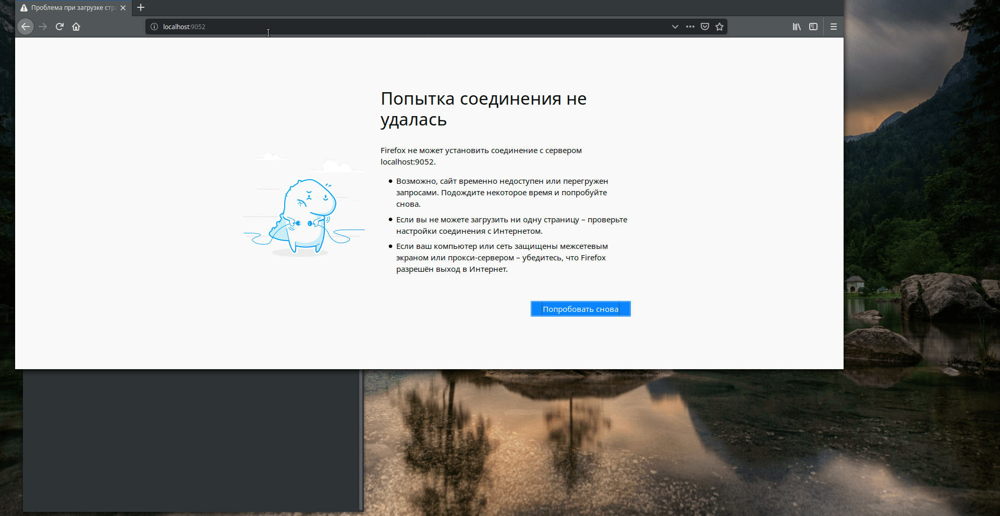

 
===========
SHORT INTRO
- (STATUS - work in progress - contributions are wellcome)

This is a lib for providing simple way of developing UI apps 
in async style using 
trio library as asychronous engine 
and remi library for UI rendering ...

All sessions of user are duplicated -
 so if anyone logins into the system from different devices - he will see the same environment...

--------
FEATURES
-
 - added concept of service and application
    
    - cloud_ui.services.service.Service class
        
        - get_list  - returns a list of available methods
        - get_name  - service name representation
        - start     - starts current service instance(async)
        - stop      - stops(not implemented)
        - request(meth, args)   - make request for service instance(async)
        - process(meth, args)   - handling methods processing by name and args...
   
    - cloud_ui.apps.application.Application(inherited from Service)
        - run_instance(cloud, session=None)     - starts the main application event-loop if session is None else creates app for user-session
        - a         - wraps async callback for synchronous code-flow...
        - add_background_job(coro) - add some coro to scheduler ...
        - notify    - send notification to UI-clients...
        - init_gui__ - prepare all key controls ...
        - build     - build UI-controls container of application 
        
    - cloud_ui.cloudapp.UICloud
        - list_applications - returns a list of registered apps...
        - list_services - returns a list of registered and running services 
        - get_application(appname) - get application by name
        - get_service(service_name) - get a service by name
        - wait_service(service_name) - wait for a service started ...
        - start_service(service_name) - start service by name
    
    - cloud_ui.cloudapp.UICloudApp - main session environment app
        - @username - returns cookie(username)
        - @session - return session handler(self)
        - @cloud - return UICloud instance
        - update - force UI-update
        - add_background_job -...
        - send_notification - send notification message to UI-client sessions...
        - is_admin - ...
        - start_application - start application by name (wrapper for run_instance) with preparing UI-window controls ...
 
 - Services:
    - cloud_ui.services.dummy.DummyService - dummy service...
    - cloud_ui.services.keystore.KeyStoreService - simple json-file based storage...
    - cloud_ui.telegram_notification.TelegramNotificationService - simple telegram-api based notification service with notification rooms subscribing and simple telegram-client subscribing commands - authorization by admin panel TelegramNotificationManageApplication
 
 - Applications:
    - cloud_ui.apps.dummy.DummyApplication - dummy application...
    - cloud_ui.apps.telegram_notification.TelegramNotificationManageApplication - ui telegram notification app
    - cloud_ui.apps.keystore.KeyStoreApplication - manage saved keys app ..
 
 - Components:
    -  model_view component - helper for representation data via tables using async requests ...
        
 - Widgets:
    - added table widget which may contain UI-controls in chars...
    - added PlotWidget - for drawing plots(matplotlib-backend)
--------
EXAMPLE
-


main.py
```python

from remi.aserver import start, HttpRequestParser

from cloud_ui.auth.dirrect import DirrectAuth
from cloud_ui.cloudapp import UICloudApp, UICloud


from simple import SimpleApplication, SimpleService


def main():
    UICloud.services = [SimpleService]
    UICloud.applications = [SimpleApplication]

    auth = DirrectAuth()
    auth.add_user(username="admin", password="password", is_admin=True)
    app = UICloud(UICloudApp, HttpRequestParser, 9052, auth)
    start(app)


if __name__ == "__main__":
    main()
```

simple.py
```python

from remi import gui
from cloud_ui.apps.application import Application
from cloud_ui.services.service import Service


class SimpleService(Service):

    @classmethod
    def get_name(self):
        return "simple-math"

    async def process(self, name, arguments):
        print(f"[{self.get_name()}] processing {name}, {arguments}")
        if name == "mul":
            return self.process_mul(arguments['x'], arguments['y'])
        elif name == "add":
            return self.process_add(arguments['x'], arguments['y'])

    @classmethod
    def list(cls):
        return ["add", "mul"]

    @staticmethod
    def process_mul(x, y):
        return x * y

    @staticmethod
    def process_add(x, y):
        return x + y


class SimpleApplication(Application):

    @classmethod
    def get_name(cls):
        return "dummy"

    def init__gui__(self):
        self.x = gui.TextInput()
        self.y = gui.TextInput()

        self.hbox = hbox = gui.HBox(width="100%")
        hbox.append([
            gui.Label("X = "),
            self.x,
            gui.Label("Y = "),
            self.y
        ])
        self.label = gui.Label(text=f" Result: ")
        self.button = gui.Button("update")
        self.button.onclick.do(self.onclickbutton)

    def build(self):
        vbox = gui.VBox(width="100%")
        vbox.append(self.hbox)
        vbox.append(self.label)
        vbox.append(self.button)
        return vbox

    def onclickbutton(self, event):
        self.server: 'UICloud'
        x = int(self.x.get_text())
        y = int(self.y.get_text())
        service = self.cloud.get_service('simple-math')

        async def onclickbutton(nursery):
            print("sending echo-request to service dummy", service)
            response_add = await service.request("add", dict(x=x, y=y))
            response_mul = await service.request("mul", dict(x=x, y=y))

            self.label.set_text(f" Result: {x} + {y} = {response_add}, {x} * {y} = {response_mul}")
            self.session.set_need_update()

        print("was sent")
        self.add_background_job(onclickbutton)
```

-------
TODO
-
    - fix mouse windows manipulations ...
    - fix apps window sizes detection for correct resizing manipulations ...
    - add running tasks bar
    - add running services bar - for stopping ...
    - add close-app button handlers
    - add minimize-app button handlers
    - ADD support for registration client-side services over http using tokens 
    - add support of registration users
    - add more applications, services and examples
    - ADD mysql-browser
    - add postgres-browser
    - ADD services-explorer app
    - ADD client-apps services-usage controll subsystem
    - ADD shared-by-user text-editor-app for parrallel edition ...
    
    
--------------------------------------
Fast start using bash, pip, virtualenv
-

```bash
$ git clone https://github.com/flexiblecloud/cloud_ui
$ cd cloud_ui
$ python3.6 -m pip install virtualenv
$ python3.6 -m virtualenv --no-site-packages .env
$ source .env/bin/activate
$ pip install -r requirements.txt
$ python -m examples.simple
$ python -m examples.plot_timeline
$ python -m examples.model_view_simple

```

-------------------------------------
Fast start using docker ...
-
```bash
$ git clone https://github.com/flexiblecloud/cloud_ui
$ cd cloud_ui
$ docker build -t test_cloud_ui -f Dockerfile.example.simple .
$ docker run --rm -it --net=host test_cloud_ui
```

---------
model_view_simple example(with control/manipulation bugs yet ...)
- 

